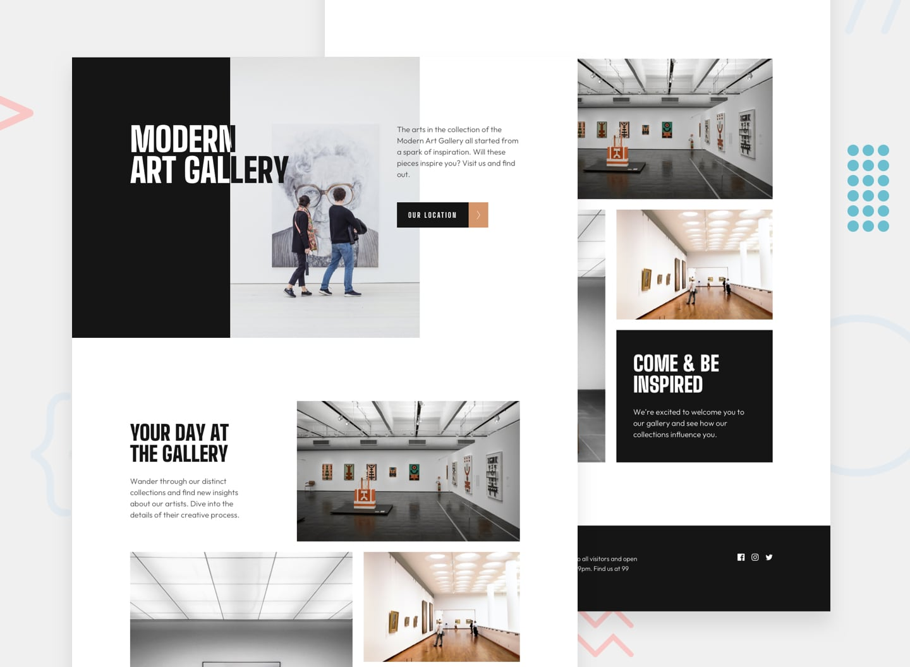

# Frontend Mentor - Profile-card-component

This is a solution to the [Art-gallery-website]

## Table of contents

  - [What I learned](#what-i-learned)
  - [Screenshot](#screenshot)
  - [Links](#links)
  - [My process](#my-process)
  - [Built with](#built-with)
  - [Author](#author)

## what i learned
l learned how to use grid, it was my firs project in which i have used grid property.

### Screenshot

### Links

- Solution URL: [Add solution URL here](https://github.com/DavitDvalashvili/Art-gallery-website)
- Live Site URL: [Add live site URL here](https://davitdvalashvili.github.io/Art-gallery-website/)

## My process
- Added html tags.
- Added font families and css file.
- Assigned ids to tags
- Styled css
- use flexbox
- use grid
- use hover
- use media queries for responsive site

### Built with

- CSS custom properties
- Semantic HTML5 markup
- Flexbox
- Grid propertis
- Media queries for responsive website
- position properties
- Mobile-first workflow

## Author

- Github profile - [Add your name here](https://github.com/DavitDvalashvili)
- Linkedin profile - [Add your name here](https://www.linkedin.com/in/davit-dvalashvili-0421b6253)
- Email - [@yourusername](davitdvalashvili1996@gmail.com)

